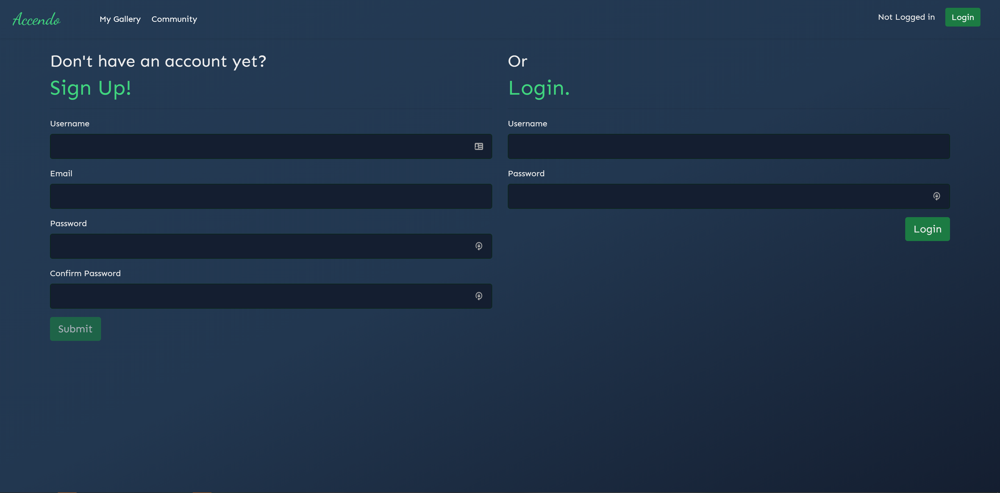
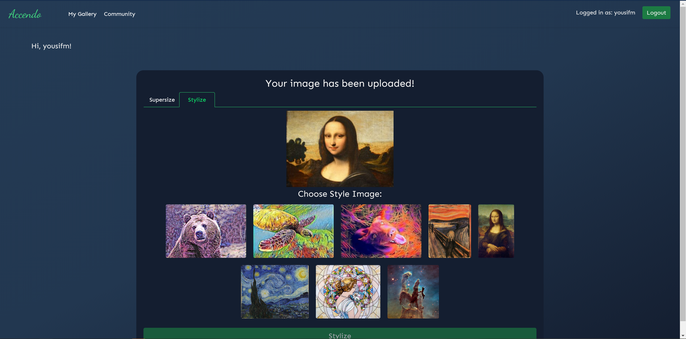
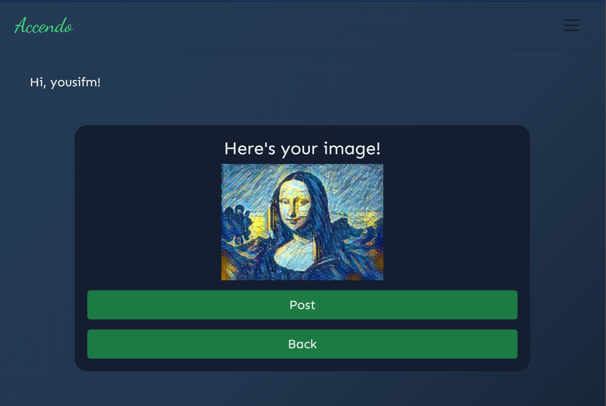
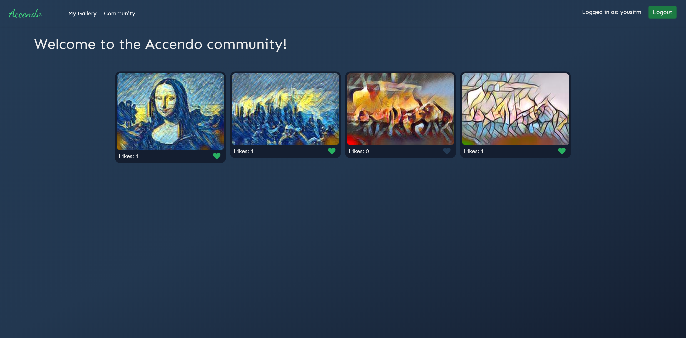
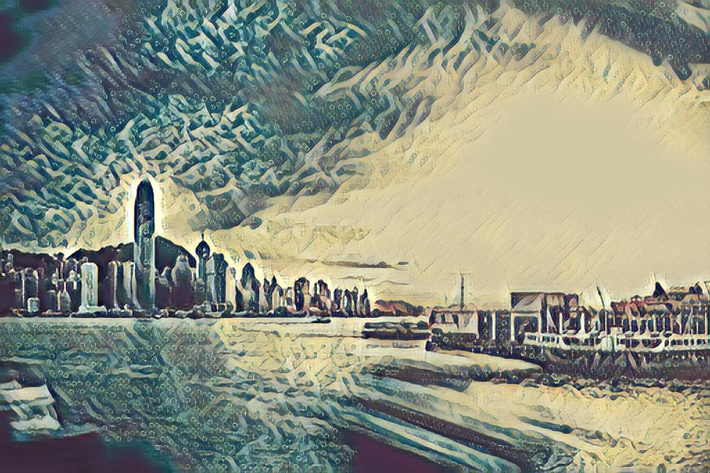

## Introduction
A web app which enables users to upload images, have them supersized or stylized with custom styles using deep learning models like neural style transfer & Super Resolution GAN, and optionally post them on the community gallery. Users can also see each other's posts on the gallery and like them. 

This was a group project for the junior year course CSCI3100 Software Engineering taught by Prof. Michael Lyu at CUHK. 

Tech stack: React, Flask, PyTorch, MongoDB, Docker

## Architecture

## Frontend 

&nbsp;

## Deep Learning Models

### Neural Style Transfer

#### Architecture

#### Example

##### Content Image

##### Style Image

##### Stylized Image

### SRGAN

#### Architecture

#### Example

### References
[1] Johnson, Justin, Alexandre Alahi, and Li Fei-Fei. "Perceptual losses for real-time style transfer and super-resolution." European conference on computer vision. Springer, Cham, 2016. [https://arxiv.org/abs/1603.08155]

[2] Ledig, Christian, et al. "Photo-realistic single image super-resolution using a generative adversarial network." Proceedings of the IEEE conference on computer vision and pattern recognition. 2017. 
